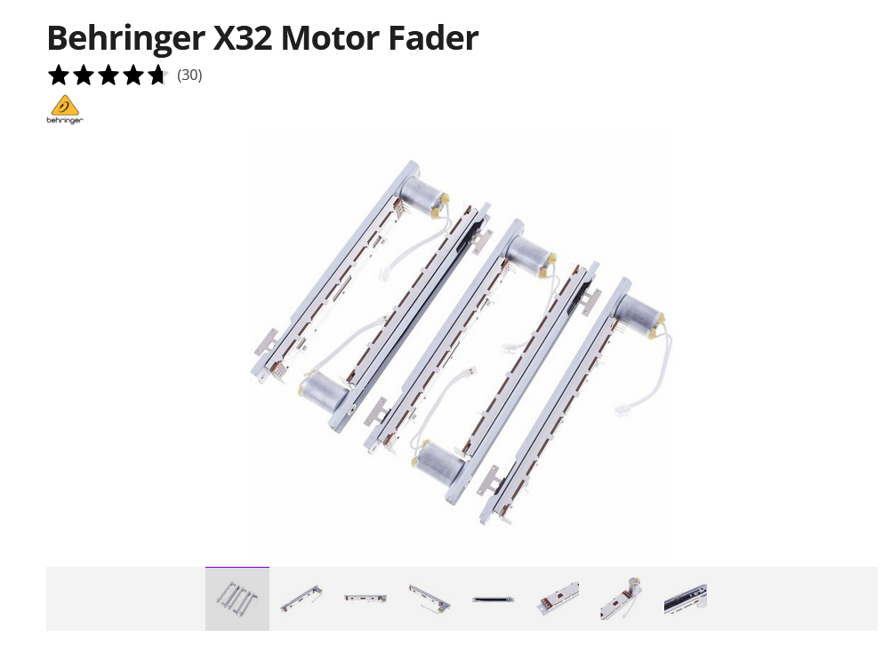
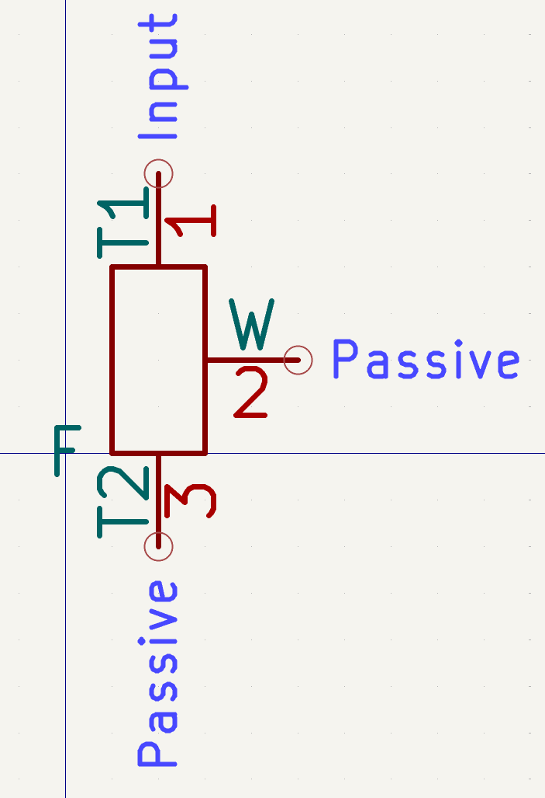

# Behringer X32 Motorized Faders

## Specifications
- **Travel:** 100mm
- **Resistance:** 10kΩ
- **Motor:** DC motor, separate JST connector
- **PCB Size:** 160mm × 22.8mm
- **Pot Pins:** 4-pin through-hole, 1.0mm pitch, 3.75mm row spacing
- **Motor:** 2-pin JST connector (separate from PCB pins)
- **Mounting:** 4× Ø1.5mm NPTH holes

## Files
- **Footprint:** `footprint/Fader_Motorized_100mm.kicad_mod`
- **Symbol:** `symbol/Fader_Motorized_100mm.kicad_sym`

## Pinout — Pot (Unit A)
| Pin | Name | Function |
|-----|------|----------|
| 1 | T1 | Track end 1 |
| 2 | W | Wiper |
| 3 | T2 | Track end 2 |
| 4 | W | Wiper (shorted to pin 2) |

## Pinout — Motor (Unit B)
| Pin | Name | Function |
|-----|------|----------|
| A | M+ | Motor positive |
| B | M- | Motor negative |

## Notes
- Pins 2 and 4 are internally shorted (dual wiper contact)
- Mechanical anchor pins (4×) are NPTH, no electrical connection
- Motor polarity determines fader direction