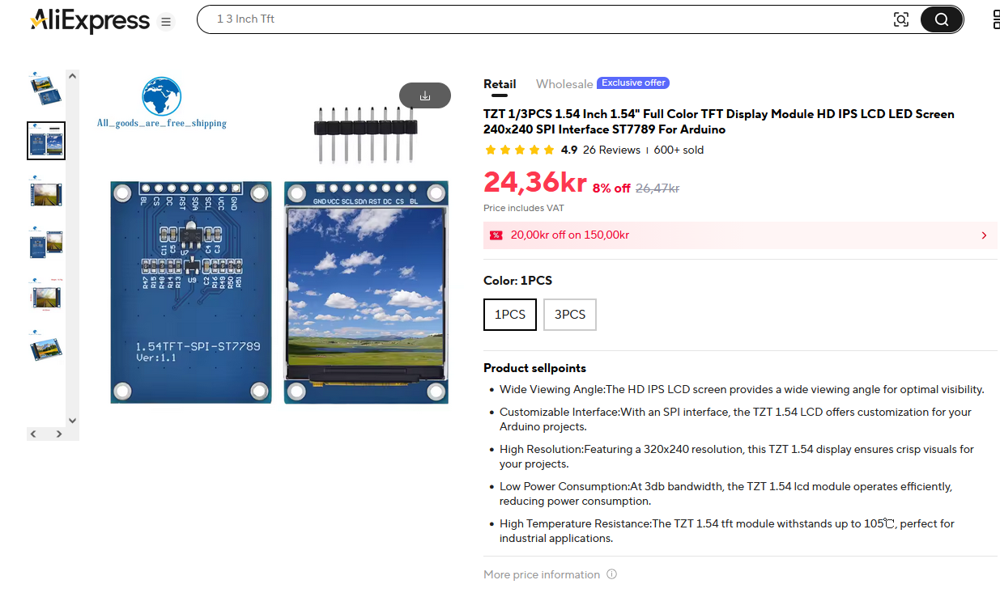
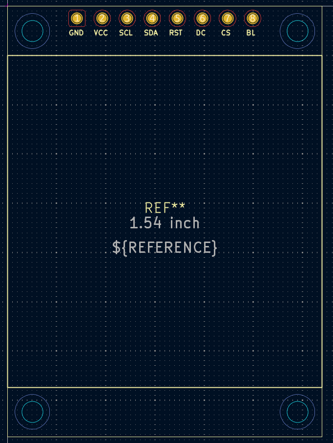
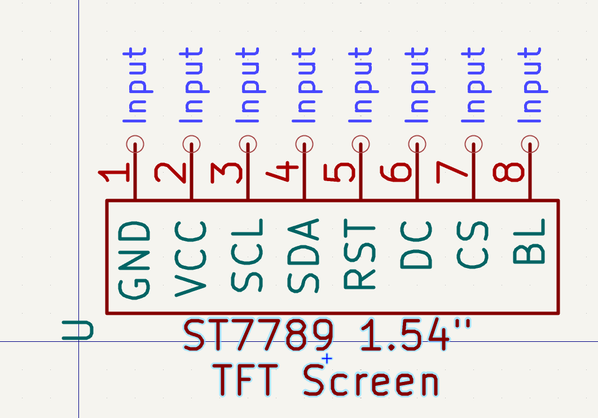

# Display_SPI_ST7789

1.54" TFT LCD Display Module (ST7789 Controller)

## Specifications

- **Resolution:** 240×240 pixels
- **PCB Size:** 32mm × 43.7mm
- **Interface:** SPI (8-pin, 2.54mm pitch)
- **Pins:** GND, VCC, SCL, SDA, RST, DC, CS, BL
- **Mounting:** 4× M2 holes

## Files

- **Footprint:** `footprint/Display_SPI_32x43.5mm_8Pin.kicad_mod`
- **Symbol:** `symbol/Display_SPI_ST7789.kicad_sym`

## Pinout

| Pin | Name | Function |
|-----|------|----------|
| 1 | GND | Ground |
| 2 | VCC | Power (3.3-5V) |
| 3 | SCL | SPI Clock |
| 4 | SDA | SPI Data |
| 5 | RST | Reset |
| 6 | DC | Data/Command |
| 7 | CS | Chip Select |
| 8 | BL | Backlight |